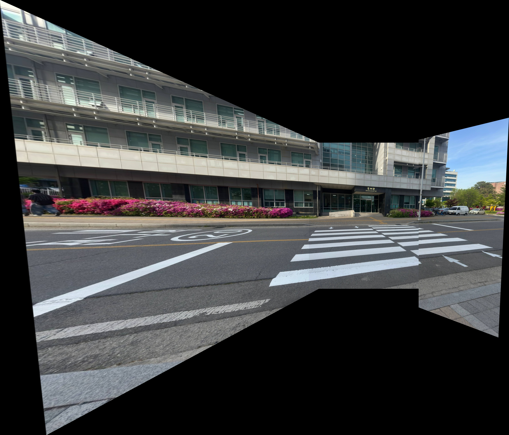

# Panoramic Image Stitcher

## Overview
This repository contains a custom implementation of an image stitching pipeline using OpenCV and Python. It automatically aligns and stitches 3 or more overlapping images into a single panoramic view. 

To comply with the assignment requirements, this program is **implemented from scratch** using classical computer vision techniques and explicitly avoids using high-level APIs like `cv2.Stitcher`.

## Implementation Details
The stitching process follows these core steps:
1. **Feature Detection & Description:** Uses the `SIFT` (Scale-Invariant Feature Transform) algorithm to extract keypoints and local descriptors from the images.
2. **Feature Matching:** Uses the `FLANN` based matcher alongside Lowe’s ratio test to find robust correspondences between image pairs.
3. **Homography Estimation:** Applies the `RANSAC` algorithm to reject outliers and compute the perspective transformation matrix (Homography) between the images.
4. **Warping & Blending:** Uses `cv2.warpPerspective` to project the images onto a common planar canvas.

## ✨ Extra Feature: Automatic Image Cutting (Auto-Cropping)
When taking real panoramic photos, camera rotation naturally causes perspective warping. When these images are stitched onto a flat canvas, irregular black backgrounds (empty space) naturally appear around the stitched image. 

I implemented an automatic image cutting function (`crop_black_borders()`) that acts as a post-processing step. 
* **How it works:** It converts the raw stitched image to grayscale, applies binary thresholding to isolate the non-black regions, and uses `cv2.findContours` to detect the bounding box of the actual stitched content. 
* **Result:** It automatically crops out the ugly black borders, resulting in a clean, perfectly rectangular final panoramic image.

## Results & Screenshots

### 1. Input Images (3 Overlapping Views)
*(Real photos taken with overlapping regions)*

**Left View:**
 

**Center View:**

**Right View:**

### 2. Final Output: Stitched & Auto-Cropped Panorama
The images were successfully stitched, and the irregular black borders created by perspective warping were automatically detected and removed by my extra feature.

